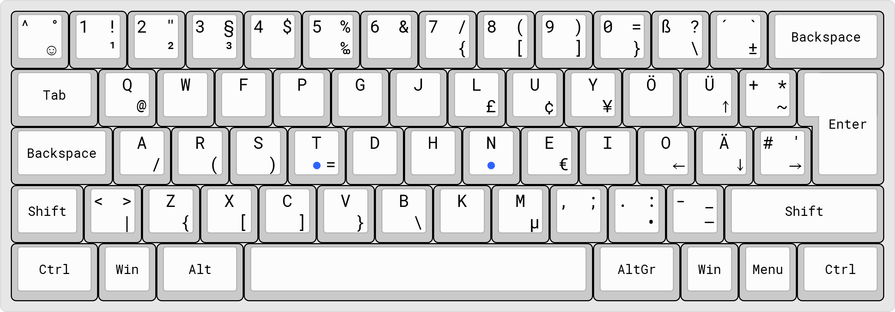

## Colemak DE keyboard layout

This is a customized version of the [Colemak](https://colemak.com/) layout for German keyboards. It was created using the Microsoft Keyboard Layout Creator (MSKLC).

Differences to the "standard" version of Colemak:

- All special characters remain in the same spot as on a regular German ISO keyboard.
  - One exception is the <kbd>Ö</kbd> key which had to be moved up one row.
- A few (more or less) handy special characters were added to <kbd>Alt Gr</kbd>-combinations.
  - This includes some duplicates to try and make them easier to write.